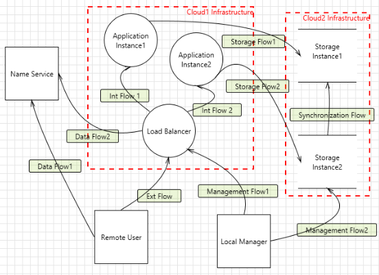

# Common Cloud Computing Threat Model (CCCTM) template

## Description 

The Common Cloud Computing Threat Model (CCCTM) describes basic threats against cloud computer systems from the architectural point of view. 
CCCTM is based on Data Flow Diagrams (DFD) to represent computer system design, and the Application threat modelling approach (OWASP, Microsoft) as a part of the Security Development Life Cycle (SDL) practices.

The model is implemented as a threat template in the XML format for the Microsoft Threat Modelling (TM) tool.

Using the CCCTM template and Microsoft TM tool, you can represent your cloud-based system as a DFD diagram and get a list of the relevant threats to the system.

## Using

Download the [CCCTM template](CCCTM_template.tb7) from this repository and [Microsoft Threat Modeling Tool](https://aka.ms/threatmodelingtool) from their website. 

Run the Microsoft TM tool, use the CCCTM template to create a picture like this:

and you will get a table like that:

## Extra information

About [Microsoft TM](https://docs.microsoft.com/en-us/azure/security/develop/threat-modeling-tool)

About Application threat modelling [from OWASP](https://www.owasp.org/index.php/Application_Threat_Modeling) and [from Microsoft](https://www.microsoft.com/en-us/securityengineering/sdl/threatmodeling)

## References

Cloud Computing Risk Assessment [Electronic resource]. / ENISA, 2009. – Mode of access: https://www.enisa.europa.eu/publications/cloud-computing-risk-assessment/at_download/fullReport.

Saripalli P. QUIRC: A quantitative impact and risk assessment framework for cloud security ./ Saripalli P., Walters B. //2010 IEEE 3rd International Conference on Cloud Computing. – IEEE, 2010. – С. 280-288.

SEcure Cloud computing for CRitical infrastructure IT [Electronic resource]. – Mode of access: https://www.seccrit.eu/. – Date of access: 27.10.2016.

## Author

[Andrei Brazhuk](https://scholar.google.com/citations?user=lxR8RLkAAAAJ&hl)

